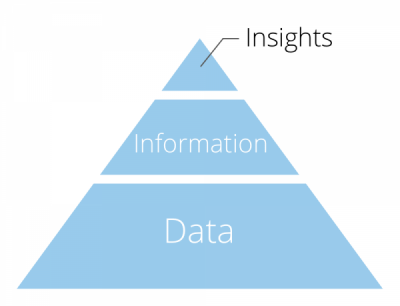

# Chapter 1 - Data
## အရာအားလုံးက Data ကစတာပဲ။

ခေတ်သစ်တခုကိုရောက်ရှိနေပါပြီ။ ကျွန်တော်တို့ မြန်မာနိုင်ငံကတော့ ခေတ်သစ်တခုကို စပြီးခြေလှမ်းပါပြီဆိုတဲ့အချိန်မှာပဲ ခေတ်နောက်ပြန်ဆွဲခြင်းကို အတင်းအဓမ္မပြုကျင့်ခံလိုက်ရပါတယ်။ ဒါပေမဲ့ ခေတ်ကတော့ ရပ်မနေပါဘူး။ သွားစရာရှိတာဆက်သွားနေပါတယ်။

ဒီဘက်ခေတ်သစ်မှာ အသစ်သစ်သောနည်းပညာတွေဟာ တပြိုင်နက်တည်းပေါ်ထွန်းနေပါတယ်။ ဒါပေမဲ့ ဒီအ‌ရာတွေအားလုံးကြားထဲမှာ အခြေခံအကျဆုံးအရာကတော့ data ပဲဖြစ်ပါတယ်။
Data ကို ကျွန်တော်တို့ အချက်အလက်လို့ပဲခေါ်ကြတာပေါ့။ အရင်တုန်းကတော့ data ဆိုရင် စာရင်းဇယားတွေနဲ့ excel sheet တွေလို့ပဲ ပြေးမြင်ကြတဲ့သူများပါတယ်။ အခုနောက်ပိုင်းမှာ Image, Video, Audio တွေကိုပါ data ရယ်လို့ လူသိများလာပါတယ်။ ဒါတင်မကပါဘူး။ ပတ်ဝန်းကျင်မှာရှိသမျှဟာ အချက်အလက်ဖြစ်ပါတယ်။ ကျွန်တော်တို့ကိုယ်တိုင်ကလည်း အချက်အလက်တွေဖြစ်ပါတယ်။
ပတ်ဝန်းကျင်က အရာရာတိုင်းကိုစနစ်တကျစောင့်ကြည့်လေ့လာပြီးမှတ်တမ်းတင်လို့ရပါတယ်။ ဒီဟာတွေက data တွေပါ။ လူတယောက် မနက်ဘယ်အချိန်မှာထတယ်။ မနက်စာဘာစားတယ်။ မနက်စာစားနေတဲ့အချိန်ဘာလုပ်တယ်။ နေ့လည်စာဘယ်လိုအချိုတည်းတယ်။ အိမ်ထောင်ရှိတယ်။ ညစာအနေနဲ့ ဟော့ပေါ့သွားစားရတာကို သဘောကျတယ်။ ဘယ်အချိန်မှာအိပ်တယ်။ မအိပ်ခင် ဘယ်လိုဇာတ်ကားမျိုးကြည့်တယ်။ နာရီဘယ်လောက်ကြာကြာအိပ်တယ်။ ဒါတွေအားလုံးဟာ data တွေပဲဖြစ်ပါတယ်။

ဒီ data တွေဟာ ဘယ်လောက်အဖိုးတန်လဲဆိုတာ မြန်မာပြည်သူတွေသတိထားမိမယ် မထင်ပါဘူး။ တကယ်တော့ ဒီ data တွေဟာ ခေတ်သစ်ကမ္ဘာရဲ့ရွှေ၊ ခေတ်သစ်ကမ္ဘာရဲ့ရေနံလို့ တင်စားလို့ရပါတယ်။
ခေတ်သစ်ကမ္ဘာရဲ့ နည်းပညာလုပ်ငန်းတော်တော်များများဟာ ဒီ data တွေအပေါ်မှာ အဓိကအခြေခံပြုရပါတယ်။ အဓိကကတော့ Machine Learning လို့ခေါ်တဲ့ စက်တွေရဲ့သင်ယူမှုဟာ data ပေါ်မှာ အခြေတည်တာဖြစ်ပါတယ်။
ဒါ့ကြောင့် ခေတ်သစ်ကမ္ဘာတည်ဆောက်ဖို့ data တွေဟာ အခြေခံအကျဆုံးအရာလို့ပြောရခြင်းဖြစ်ပါတယ်။

## အချက်အလက်နှင့်သတင်းအချက်အလက်

Data ကို အချက်အလက်လို့ပဲခေါ်ကြတာပေါ့။ အချက်အလက်တစုံ၊ အချက်အလက်တခုက သူ့ကိုယ်ပိုင်တန်ဖိုးနဲ့ရှိနေနိုင်ပေမဲ့ အဓိပ္ပါယ်ကိုခြုံငုံပြီးမပြောပြနိုင်ပါဘူး။ သတင်းအချက်အလက်(Information) ကတော့ အဲ့ဒီအချက်အလက်တွေကို စုပြုံပြီးတော့ ပိုင်းခြားဆုံးဖြတ်ခြင်းအားဖြင့် တစုံတခုအနေနဲ့အဓိပ္ပါယ်ဖွင့်ဆိုထားနိုင်တာဖြစ်ပါတယ်။
ရှင်းရှင်းပြောရရင်
- ဂဏန်းတွေ၊သင်္ကေတတွေ၊စာလုံးတွေ၊စာသားတွေ၊ကုဒ်နံပါတ်တွေစတာတွေကို Data(အချက်အလက်တွေ)လို့ ခေါ်ဆိုတာဖြစ်ပြီးတော့ Information(သတင်းအချက်အလက်) ဆိုတာ အဲ့ဒီအချက်အလက်တွေကို ဘယ်လိုနားလည်လဲဆိုတာပါပဲ။
- Information ဟာ Data တွေပေါ်မှာ အခြေခံပြီးတော့မှ ဝေဖန်ပိုင်းခြားထုတ်နုတ်ကောက်ချက်ချရတာဖြစ်ပါတယ်။

Data နဲ့ Information တွေရဲ့ အဓိပ္ပါယ်၊ သုံးနှုန်းပုံဟာ သက်ဆိုင်ရာပညာရပ်နယ်ပယ်ပေါ်မူတည်ပြီးကွာခြားတတ်ပါတယ်။
ဥပမာ။
စာသင်ခန်းတခန်းရဲ့ကျောင်းသားတွေရဲ့ ကျောင်းသားတွေရဲ့ အမှတ်စာရင်းဇယားတွေဟာ Data(အချက်အလက်)ဖြစ်ပြီးတော့ ဒီအချက်အလက်တွေပေါ်မှာတွက်ချက်ပြီးတော့ စာသင်ခန်းရဲ့ပျမ်းမျှရမှတ်ကိုသိရှိခြင်း ဆိုတာကတော့ Information(သတင်းအချက်အလက်)ပဲဖြစ်ပါတယ်။

လွန်ခဲ့တဲ့ရာစုနှစ်အတွင်း ကမ္ဘာ့အပူချိန်စာရင်းအတိုင်းအတာတွေဟာ အချက်အလက်တွေဖြစ်ပြီးတော့ ဒီအချက်အလက်တွေပေါ်ကနေ ကမ္ဘာ့အပူချိန်မြင့်တက်လာတယ်ဆိုတာ တွက်ချက်ခြင်းကတော့ သတင်းအချက်အလက်ဖြစ်ပါတယ်။

Website တခုကို ဝင်ကြည့်တဲ့သူဦးရေကို မြို့တွေနဲ့ခွဲမှတ်ထားတာကတော့ data ဖြစ်ပြီးတော့ ပြီးခဲ့တဲ့နှစ်အတွင်းမှာ ရန်ကုန်၊မန္တလေးက ဝင်ကြည့်သူဦးရေကျသွားပြီး နယ်မြို့တွေကနေဝင်ကြည့်တဲ့သူဦးရေတက်လာတယ်ဆိုတာကတော့ အရေးကြီးတဲ့ Information ဖြစ်ပါတယ်။

ဒီနေရာမှာ Data နဲ့ Information ရဲ့အသုံးပြုပုံဟာ စာရင်းအင်းပညာနယ်ပယ်က ဥပမာတွေချည်းပဲဖြစ်ပါတယ်။ ဇီဝဗေဒ၊ ဓာတုဗေဒတွေနဲ့ အခြားနယ်ပယ်တွေမှာလည်း Data နဲ့ Information ကိုအဓိပ္ပါယ်ဖွင့်ဆိုကြပါသေးတယ်။ အနည်းနဲ့အများတော့ကွာခြားမှုရှိတတ်ပါတယ်။
ထွက်လာတဲ့ Information ကအရေးပါပေမဲ့လို့ Data ဟာလည်းအရေးကြီးပါတယ်။ ဥပမာ။ ဆေးပညာဆိုင်ရာသုတေသနတွေမှာ ထွက်လာတဲ့ information ကိုသက်သေတကျခိုင်ခိုင်မာမာရှင်းလင်းတင်ပြဖို့အတွက် ရရှိထားတဲ့ စမ်းသပ်မှုတွေ၊တိုင်းတာမှုတွေရဲ့ data ကို သက်သေအနေနဲ့အမြဲကိုင်ထားရပါတယ်။

### Insights (သိမြင်မှု)

Insights(သိမြင်မှု) ဆိုတာကတော့ သတင်းအချက်အလက်တွေပေါ်မှာ ကောက်ချက်ချ၊ပိုင်းခြားတာဖြစ်ပါတယ်။ ဒီကောက်ချက်ချမှုတွေကနေပဲ Action(လုပ်ရပ်)တွေဖြစ်လာတာဖြစ်ပါတယ်။
ဥပမာ။ ‌စာသင်ခန်းရဲ့ ပျမ်းမျှရမှတ်ကိုသိတဲ့အခါ ဒီစာသင်ခန်းဟာအောင်ချက်ကောင်းလား၊မကောင်းလားကို ကောက်ချက်ချပြီး ကိုယ့်ကလေးကိုဒီစာသင်ခန်းမှာထားသင့်၊မထားသင့်ဆုံးဖြတ်တာမျိုးဖြစ်ပါတယ်။
ရန်ကုန်၊မန္တလေးကဝင်ကြည့်သွားတာနည်းသွားတဲ့ Information ပေါ်မူတည်ပြီးတော့ ပရိုမိုးရှင်းဆင်းတာ၊ ကြော်ငြာတာတွေကို နယ်မြို့တွေဘက်မှာပိုပြီးအသုံးချဖို့နဲ့ မြို့ပေါ်မှာဝင်ကြည့်တဲ့နှုန်းကျသွားတာကို ဖြေရှင်းဖို့လုပ်ရပါမယ်။ စသည်ဖြင့်ပေါ့။
ဒါ့ကြောင့်မို့လို့ အချက်အလက်၊ သတင်းအချက်အလက်နဲ့သိမြင်မှုတွေဟာ လုပ်ငန်းတိုင်းမှာအရေးကြီးပါတယ်။

