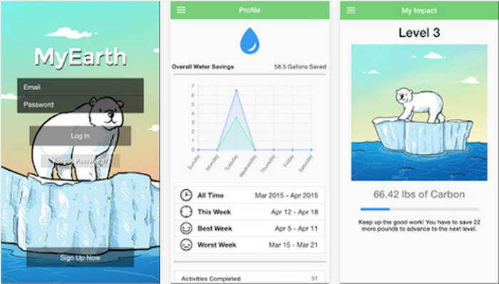

# Chapter 4 - Data Story Telling

## Data ဇာတ်လမ်းဆင်မယ်။

လူတွေရဲ့ဦးနှောက်က စနစ်ကျကျတွေးခေါ်ဖို့ထက် ခံစားချက်ပေါ်ပဲပိုဦးစားပေးပြီး ဆုံးဖြတ်ချက်တွေလုပ်တတ်တယ်ဆိုတာ လက်ခံလား။ ကျွန်တော့်အမြင်ကတော့ အဲ့လိုခံစားချက်ပေါ်မူတည်ပြီး ဆုံးဖြတ်တာကိုကပဲ လူသားဆန်မှုရဲ့တစိတ်တပိုင်းပဲဖြစ်ပါတယ်။ Data တွေကို ပိုင်းခြားတွက်ချက်ပြီးသည့်တိုင်အောင် ရလာတဲ့ရလာဒ်ထက် လူတွေဟာ သူတို့ယုံကြည်ချင်တာကိုပဲ ယုံချင်တုန်းပါပဲ။ အထူးသဖြင့်ကျွန်တော်တို့ရလာဒ်တင်ပြရမယ့်ပရိသတ်က လူထုကြီးဖြစ်နေရင်ပိုတောင်ဆိုးပါသေးတယ်။
ဒီနေရာမှာ ပုံပြင်ပြောဖို့လုပ်ရပါတော့တယ်။ တကယ်တော့ဇာတ်လမ်းတွေဆိုတာကလည်း ပုံပြင်တွေကနေ ဆင်းသက်လာတာပါပဲ။ ဒီတော့ ကျွန်တော်တို့ရဲ့ ရရှိလာတဲ့ Insights(သိမြင်မှု) တွေဟာ လက်ခံမယ့်သူရဲ့စိတ်ခံစားချက်ကိုလွှမ်းမိုးဖို့ ဇာတ်လမ်းတွေဆင်ရပါတော့တယ်။ တကယ်တော့ data ဇာတ်လမ်းဆင်ရတာအချိန်ကုန်ပြီး အတော်လက်ဝင်တဲ့အလုပ်ပါပဲ။

Data ဇာတ်လမ်းဆင်ရတဲ့အခါမှာ အခြေခံ၃ချက်လိုအပ်ပါတယ်။ Data(အချက်အလက်), Visuals(ရုပ်ပြ) နဲ့ Narrative(ဇာတ်လမ်းသွား) ဖြစ်ပါတယ်။ Data ဇာတ်လမ်းဆင်တဲ့နေရာမှာ ဒီ၃ခုတခုနဲ့တခုပေါင်းပြီး အလုပ်လုပ်ပုံကိုသိထားဖို့ကအရေးကြီးပါတယ်။
Narrative(ဇာတ်လမ်းသွား)နဲ့ Data(အချက်အလက်)နဲ့တွဲလိုက်တဲ့အခါ ပရိတ်သတ်ကို ရှင်းပြဖို့အဆင်ပြေလာပါတယ်။ Visuals(ရုပ်ပြ)နဲ့Data(အချက်အလက်)တို့ပေါင်းလိုက်တဲ့အခါ ပရိသတ်ကိုဘာတွေဖြစ်နေလဲဆိုတာ ကိုယ်တိုင်မြင်လာစေပါတယ်။ Visuals(ရုပ်ပြ)နဲ့Narrative(ဇာတ်လမ်းသွား)ကိုပေါင်းလိုက်တဲ့အခါမှာတော့ ပရိတ်သတ်ကို အတွေးထဲဆွဲခေါ်သွားနိုင်တာမျိုးအထိ ဆွဲဆောင်နိုင်ပါတယ်။

အဓိကကတော့ မှန်ကန်တဲ့ Data(အချက်အလက်) တွေနဲ့လိုက်ဖက်တဲ့ Visuals(ရုပ်ပြ) တွေပေါင်းစပ်ပြီး သင့်တော်တဲ့ Narrative(ဇာတ်လမ်းသွား) နဲ့ဆိုရင် ပရိသတ်ကိုလွှမ်းမိုးနိုင်ပြီးတော့ ကိုယ်လိုချင်တဲ့လုပ်ဆောင်ချက်မျိုးရအောင်ထိ တွန်းအားပေးနိုင်ပါတယ်။

အောက်ပါပုံကတော့ ကျွန်တော်သဘောကျမိတဲ့ Data Story Telling ပဲဖြစ်ပါတယ်။

ဒီပုံကတော့ MyEarth App ကပဲဖြစ်ပါတယ်။ ပုံကိုတချက်လေ့လာကြည့်တာနဲ့သူဟာဘာကိုဆိုလိုချင်တာလဲဆိုတာကို နားလည်နိုင်ပါတယ်။ ကာဗွန်ထုတ်လုပ်မှုကိုလျှော့ချဖို့အတွက် ပိုလာဝက်ဝံလေးနဲ့ Data ဇာတ်လမ်းဆင်ထားတာဖြစ်ပါတယ်။

References

Data Storytelling: The Essential Data Science Skill Everyone Needs
Brent Dykes

Image Sources — [https://www.google.com/amp/s/www.forbes.com/sites/brentdykes/2016/03/31/data-storytelling-the-essential-data-science-skill-everyone-needs/amp/](https://www.google.com/amp/s/www.forbes.com/sites/brentdykes/2016/03/31/data-storytelling-the-essential-data-science-skill-everyone-needs/amp/)